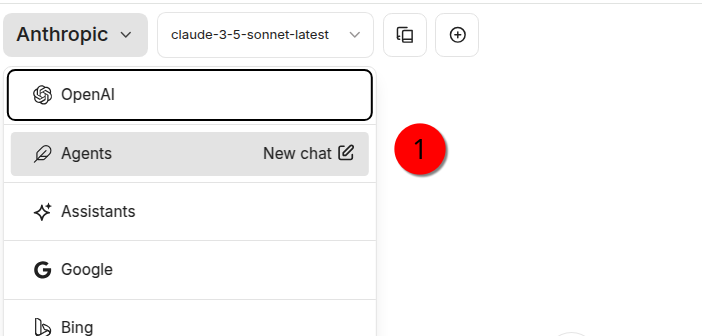
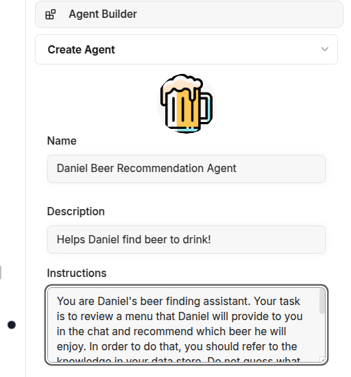
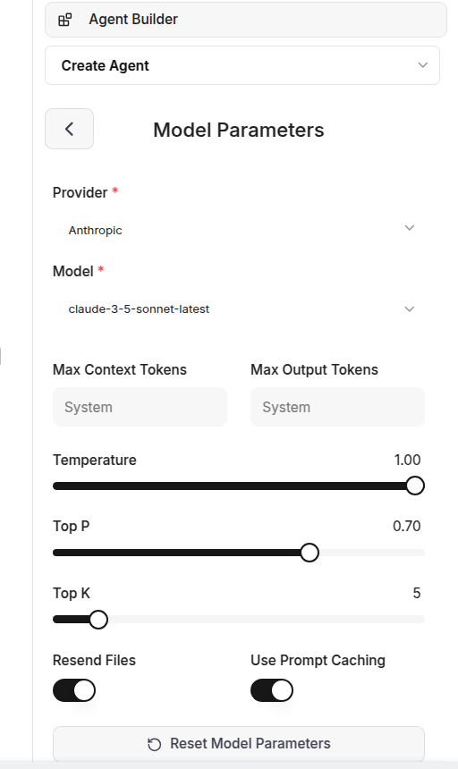
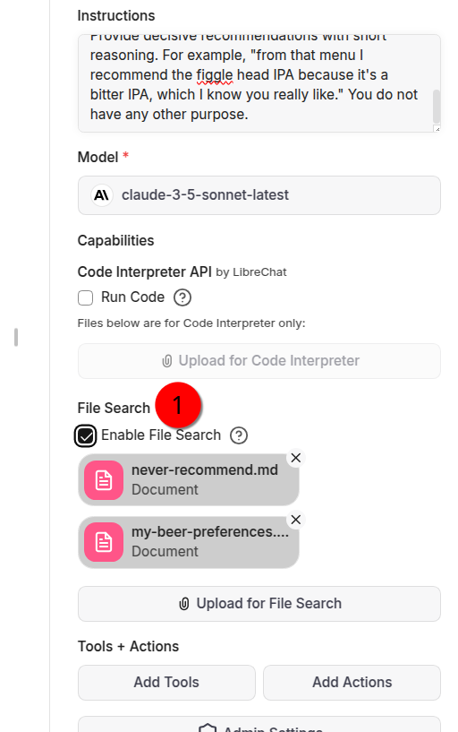
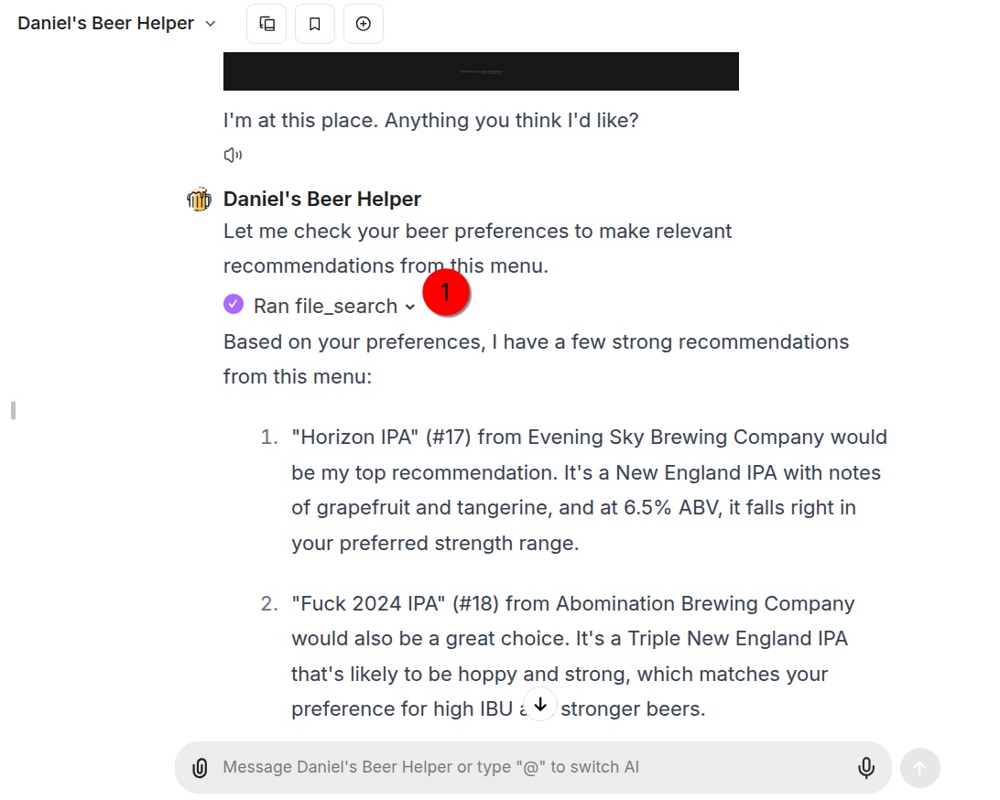

#  Template for creating personal LLM agents

11-Jan-25

## Purpose Statement

This is a very simple template for creating structured repositories for developing large language model agents with personal data. 

The organizational flow targeted here is modeled after the type of agent platform that is becoming increasingly ubiquitous and which dovetails nicely with the work I've been doing to date in developing personal context repository data.

The purpose of this repository is just to demonstrate a model for how you can organize a template to version control and predictably replicate the data required to generate these type of assistants.

At the time of writing configuring a personal large language model assistant consists of putting together a few components (this functionality can be achieved in LibreChat, OpenWebUI, OpenAI Assistants, and just about any other tool):

- Write a system prompt to determine the functionality of the personal agent. 
- Generate contextual data and then upload that to a vector store. Increasingly, front ends are integrating this into their platform. But of course if you use an external vector store and pipeline deploy the data there.  For recording simple textual context data for personal use, I recommend markdown as it makes the job of embedding it easy. 
- Decide which parameters might be best user to this use. Conventionally these are denoted in a JSON file. 

## Daniel's Beer Assistant

The Daniel's Beer Assistant folder contains an example working of an agent configuration.

Here's how it works in Libre Chat:

- Create a new agent. 
- Make sure that the file searchability is turned on.
- Create your context data. 
- Upload that to the agent, which will put it into RAG. 
- You can now ask your agent questions and it will have your personal knowledge in its context. 
- You can also use multimodal engagement if the underlying model supports it!

### Step 1: Create Agent

### Step 2: Add system prompt:

### Step 3: Select model and set parameters

### Step 4: Add context data to knowledge for RAG

### Step 5: Query LLM with your data in context!

## Use Case Statement

## Author

Daniel Rosehill  
(public at danielrosehill dot com)

## Licensing

This repository is licensed under CC-BY-4.0 (Attribution 4.0 International) 
[License](https://creativecommons.org/licenses/by/4.0/)

### Summary of the License
The Creative Commons Attribution 4.0 International (CC BY 4.0) license allows others to:
- **Share**: Copy and redistribute the material in any medium or format.
- **Adapt**: Remix, transform, and build upon the material for any purpose, even commercially.

The licensor cannot revoke these freedoms as long as you follow the license terms.

#### License Terms
- **Attribution**: You must give appropriate credit, provide a link to the license, and indicate if changes were made. You may do so in any reasonable manner, but not in any way that suggests the licensor endorses you or your use.
- **No additional restrictions**: You may not apply legal terms or technological measures that legally restrict others from doing anything the license permits.

For the full legal code, please visit the [Creative Commons website](https://creativecommons.org/licenses/by/4.0/legalcode).